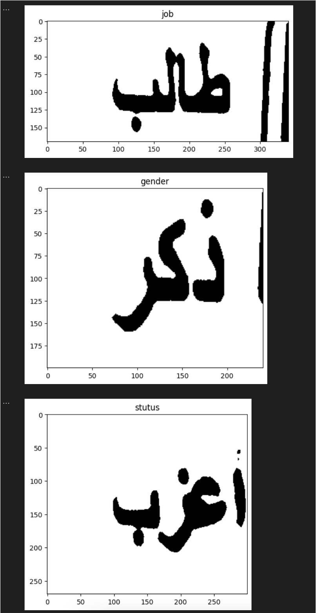

# National-ID-Card-Recognition

## Overview
This project focuses on image processing and text extraction using Optical Character Recognition (OCR). It's designed to process images, identify key features, and extract text from specified regions, employing libraries such as OpenCV and Pytesseract.

## Dependencies
- Python 3.x
- Numpy
- Pandas
- Matplotlib
- OpenCV (cv2)
- Pytesseract
- Warnings
- OS

## Installation
```bash
pip install -r requirements.txt
```

## Configuration
- Ensure Tesseract OCR is installed and configured correctly.
- Update the Tesseract path in the notebook if necessary.

## Functions Overview
1. `biggest_contour`: Identifies the largest contour in a set of contours.
2. `get_perspective`: Processes an image to isolate and transform a specific region.
3. `ocr`: Extracts text from specified image regions.
4. `main`: Orchestrates the overall process, from image processing to OCR.

## Features

### Image Processing
- **Contour Detection**: Implements advanced techniques to identify and isolate the largest contour in an image, which is crucial for focused image analysis.
- **Image Transformation**: Utilizes perspective transformation to normalize image regions for better OCR accuracy.

### Optical Character Recognition (OCR)
- **Region-Specific OCR**: Tailored OCR processing for different regions in an image, enhancing the accuracy of text extraction.
- **Support for Multiple Languages**: Efficiently handles text in various languages, making the tool versatile for international usage.

### User Interface and Visualization
- **Step-by-Step Visualization**: Each stage of image processing is accompanied by visual feedback, making it easier to understand and debug the process.
- **Interactive Analysis**: The notebook format allows for interactive experimentation and adjustments, catering to a wide range of image types and conditions.

### Customizable and Extensible
- **Modular Design**: Functions are designed to be independent and reusable, making the notebook adaptable for a variety of image processing tasks.
- **Easy Configuration**: Simple configuration steps for different environments and requirements.

### Performance and Scalability
- **Optimized Algorithms**: Utilizes efficient algorithms for rapid processing of large images.
- **Scalable Solutions**: Designed to handle both individual and batch processing of images, scaling as per the user's needs.


## Usage
To run the notebook:
1. Ensure all dependencies are installed.
2. Configure the Tesseract path as needed.
3. Run the notebook cell by cell or execute `main()` for the full process.

## Code Output 

<!--  -->

<p >
  
  
  
</p>

## License

This project is licensed under the MIT License 

---

MIT License

Copyright (c) 2024 Hossam X Studios

Permission is hereby granted, free of charge, to any person obtaining a copy
of this software and associated documentation files (the "Software"), to deal
in the Software without restriction, including without limitation the rights
to use, copy, modify, merge, publish, distribute, sublicense, and/or sell
copies of the Software, and to permit persons to whom the Software is
furnished to do so, subject to the following conditions:

The above copyright notice and this permission notice shall be included in all
copies or substantial portions of the Software.